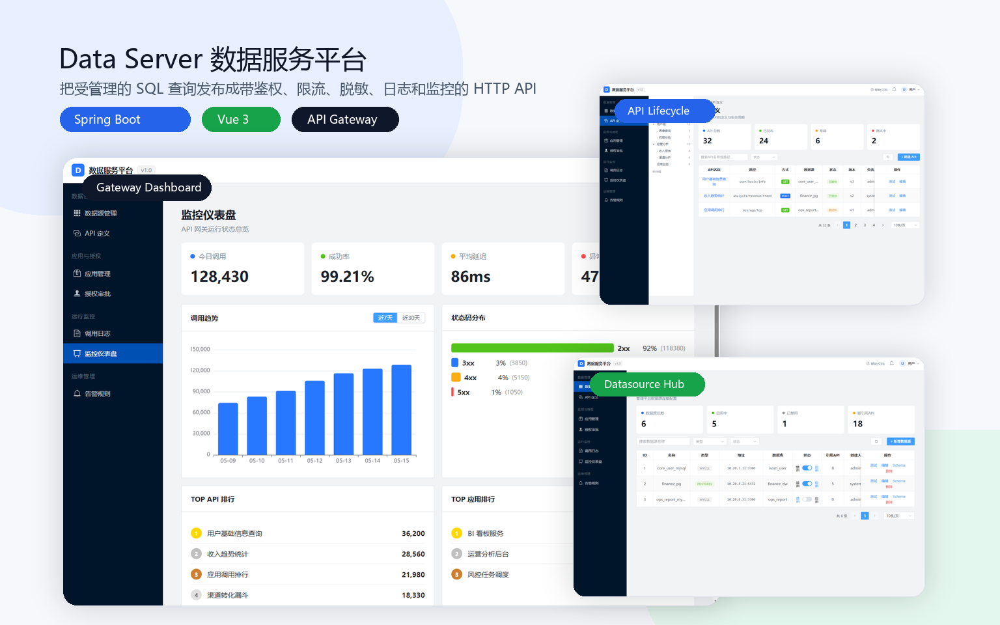
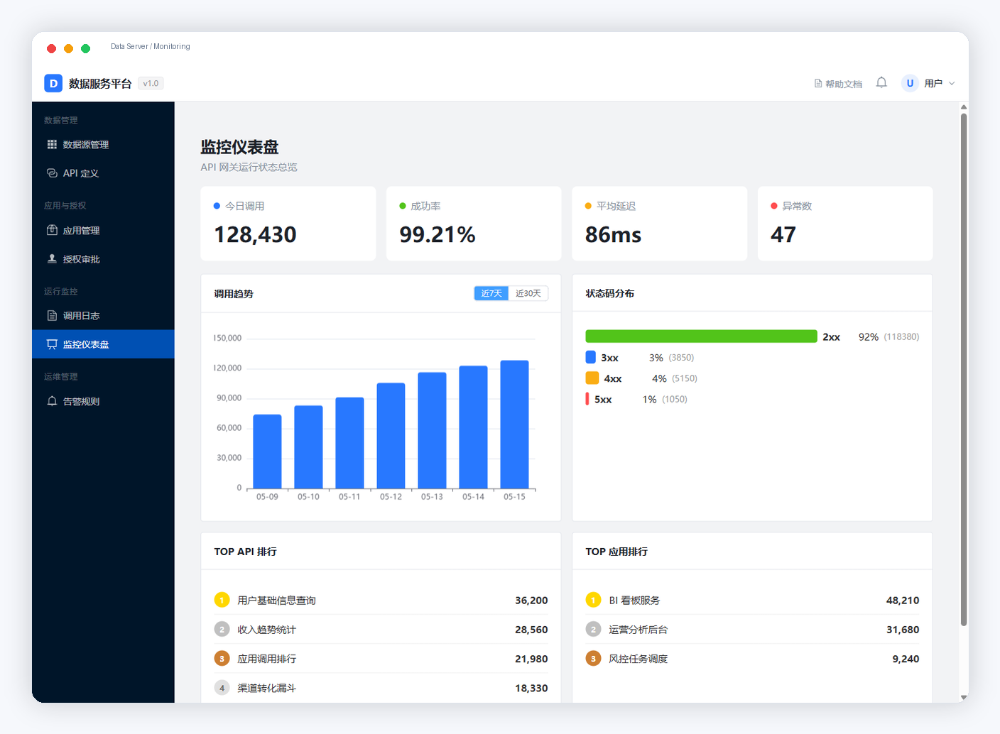
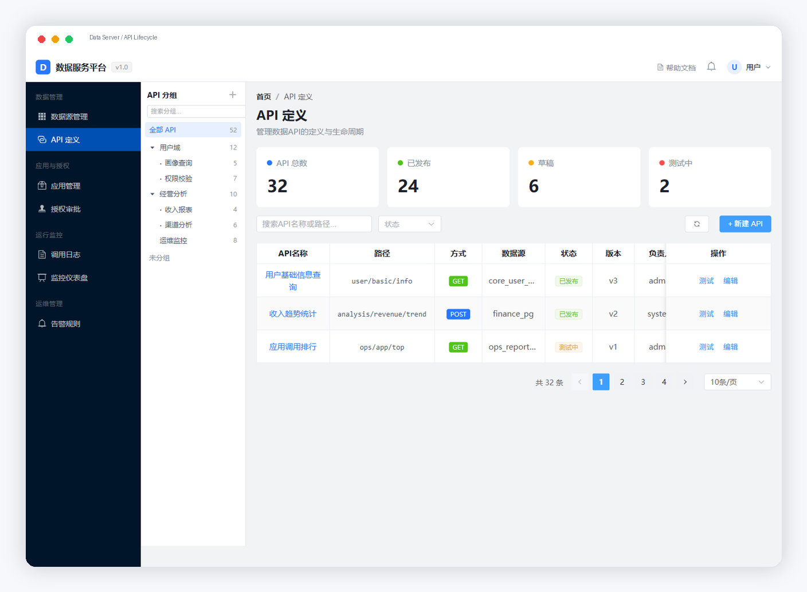
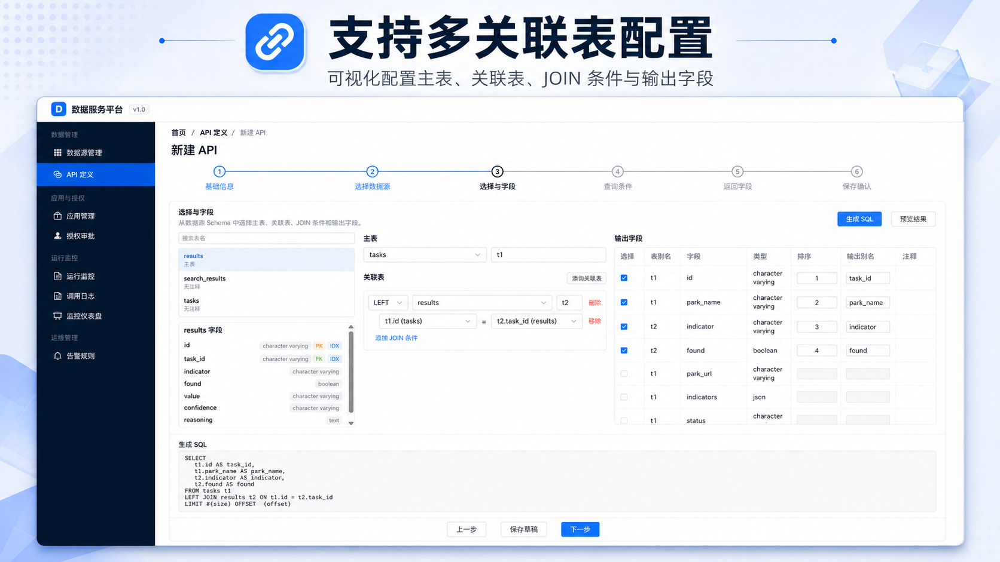
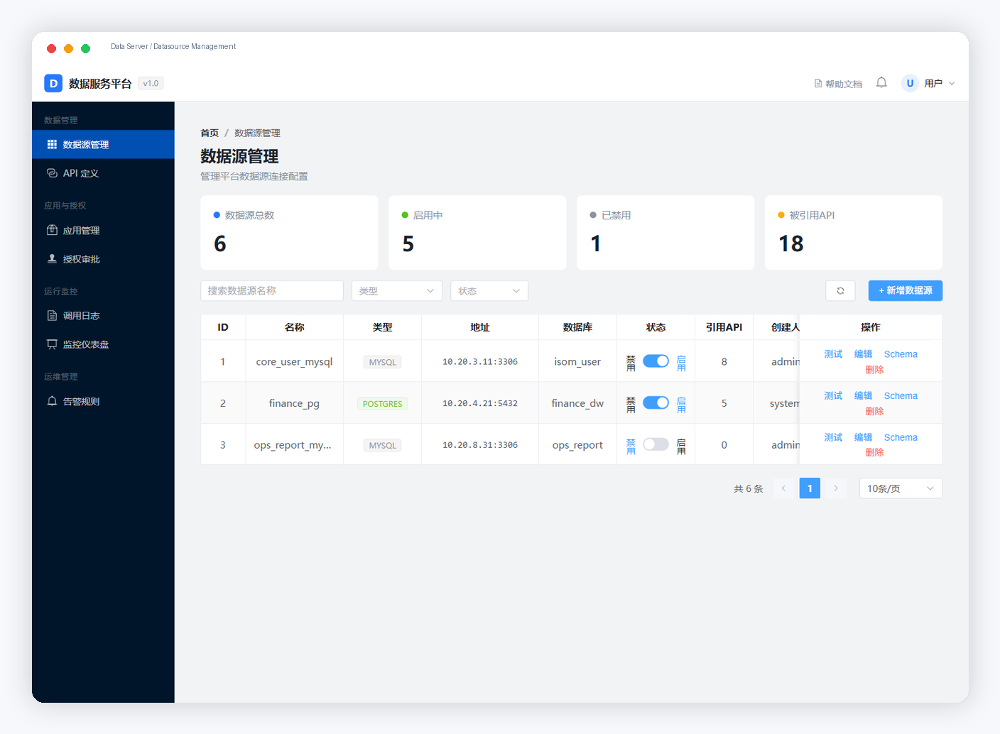

# Data Server 数据服务平台


Data Server 是一个前后端一体的数据服务平台，用于把受管理的 SQL 查询发布成带鉴权、限流、脱敏、日志和监控的 HTTP API。



本仓库包含后端 Spring Boot 多模块工程和前端 Vue 管理台。根目录 README 负责说明整体架构、快速启动路径和前后端协作关系；更细的模块说明见 [server/README.md](server/README.md) 和 [web/README.md](web/README.md)。

## 适用场景

- 内部数据平台需要把数据库查询快速开放给前端、BI、运营后台或任务系统。
- 团队不想为每个数据查询接口重复编写 Controller、鉴权、限流、日志和脱敏逻辑。
- 数据接口需要经过应用注册、凭证管理、授权申请、审批和网关统一调用。
- API 生命周期需要被平台化管理，包括草稿、发布、测试、下线、版本快照和回滚。

## 为什么值得关注

- **从 SQL 到 API**：通过管理端配置 SQL 模板、参数和响应字段，网关统一发布为 HTTP API。
- **治理能力内置**：认证、鉴权、限流、脱敏、调用日志、监控和告警不是后补脚本，而是平台主流程。
- **前后端完整闭环**：仓库同时包含 Vue 管理台、Admin API、Gateway 和共享 Runtime。
- **适合二次开发**：模块边界清晰，适合继续扩展数据库类型、权限模型、审批流和部署方式。

## 项目组成

| 路径 | 说明 |
| --- | --- |
| `server/` | 后端 Maven 聚合工程，包含共享运行时、管理端应用和网关应用 |
| `server/data-server-runtime/` | 共享运行时模块，包含实体、DTO、Mapper、Service、通用配置、SQL 执行、脱敏、迁移脚本和 Lua 限流脚本 |
| `server/data-server-admin-app/` | 管理端 Spring Boot 应用，提供数据源、API、应用、授权、日志、监控、告警和文档等管理接口 |
| `server/data-server-gateway-app/` | 网关 Spring Boot 应用，对外提供 `/gateway/**` 调用入口，负责认证、鉴权、限流、参数校验、SQL 执行、脱敏和调用日志 |
| `web/` | 前端 Vue 3 管理台，用于数据源管理、API 创建向导、应用授权、调用日志、监控告警和文档中心 |

## 核心能力

- 数据源管理：维护 MySQL/PostgreSQL 等数据源连接，查看库表结构和字段信息。
- API 设计：支持 API 分组、SQL 模板、参数解析、响应字段、版本快照、发布下线和回滚。
- 多表查询向导：在前端选择数据源、表、字段、JOIN 关系和查询条件，并生成 SQL 预览。
- 应用与授权：维护调用方应用、AppKey/AppCode 凭证、API 授权申请和审批流程。
- 网关调用：统一入口处理认证、鉴权、限流、参数校验、SQL 执行、结果脱敏和调用日志。
- 运行治理：提供调用日志、统计看板、告警规则、通知和 Knife4j/OpenAPI 文档。

## 界面预览

### 监控仪表盘



### API 生命周期管理



### 多关联表配置

支持在 API 创建向导中可视化配置主表、关联表、JOIN 条件与输出字段，并生成可预览的 SQL。



### 数据源管理



## 技术栈

| 层 | 技术 |
| --- | --- |
| 前端 | Vue 3、TypeScript、Vite、Vue Router、Pinia、Element Plus、Axios、ECharts、Monaco Editor |
| 后端 | Java 8、Spring Boot 2.5.15、Spring MVC、MyBatis Plus、Sa-Token JWT、Flyway、Redis、Actuator、Micrometer Prometheus |
| 数据库 | MySQL 主库；PostgreSQL 驱动已引入用于数据源接入 |
| 构建 | Maven、npm |

## 环境要求

| 依赖 | 默认/要求 |
| --- | --- |
| JDK | 8 |
| Maven | 3.x |
| Node.js / npm | 用于安装和运行 `web/` 前端工程 |
| MySQL | 默认 `localhost:3306`，数据库名 `data_server` |
| Redis | 默认 `localhost:6379` |
| Admin 端口 | `8080` |
| Gateway 端口 | `8081` |
| Web 端口 | `3000` |

后端默认配置位于：

- `server/data-server-admin-app/src/main/resources/application.yml`
- `server/data-server-gateway-app/src/main/resources/application.yml`

前端默认开发配置位于：

- `web/.env.development`
- `web/vite.config.ts`

## 快速启动

### 方式一：Docker Compose 一键启动

```bash
docker compose up -d --build
```

默认会启动以下服务：

| 服务 | 容器端口 | 本机地址 |
| --- | --- | --- |
| Web 管理台 | `80` | `http://localhost:3000` |
| Admin | `8080` | `http://localhost:8080` |
| Gateway | `8081` | `http://localhost:8081` |
| MySQL | `3306` | `localhost:3306` |
| Redis | `6379` | `localhost:6379` |

首次启动时 MySQL 容器会执行 `server/data-server-runtime/src/main/resources/db/migration/V1__init.sql` 初始化 `data_server` 数据库。启动后可访问：

- 管理台：`http://localhost:3000`
- Admin API 文档：`http://localhost:8080/doc.html`
- Gateway：`http://localhost:8081/gateway/{api-path}`

停止服务：

```bash
docker compose down
```

如果需要同时删除 MySQL/Redis 数据卷：

```bash
docker compose down -v
```

如果本机端口已被占用，可以覆盖宿主机映射端口：

```bash
MYSQL_PUBLISHED_PORT=13306 REDIS_PUBLISHED_PORT=16379 docker compose up -d --build
```

Web 镜像构建默认使用 `https://registry.npmmirror.com` 安装 npm 依赖。如需改回官方源：

```bash
NPM_REGISTRY=https://registry.npmjs.org docker compose build web
```

说明：当前前端源码存在若干 TypeScript 类型检查问题，Docker 镜像构建阶段使用 `vite build` 输出静态资源，避免一键体验被 `vue-tsc` 阻塞。常规本地构建仍以 `npm run build` 为准。

### 方式二：本地手动启动

### 1. 初始化数据库

先创建主库：

```sql
CREATE DATABASE data_server DEFAULT CHARACTER SET utf8mb4 COLLATE utf8mb4_general_ci;
```

Admin 服务启动时会默认执行 Flyway 迁移：

```text
server/data-server-runtime/src/main/resources/db/migration/V1__init.sql
```

Gateway 服务默认不执行 Flyway。请先启动 MySQL 和 Redis，并按需通过外部配置或环境变量覆盖数据库账号、密码、Redis、JWT 和加密密钥。

### 2. 启动后端

```bash
cd server
mvn clean package
```

启动管理端：

```bash
mvn -pl data-server-admin-app spring-boot:run
```

启动网关：

```bash
mvn -pl data-server-gateway-app spring-boot:run
```

常用地址：

| 服务 | 地址 | 说明 |
| --- | --- | --- |
| Admin API 文档 | `http://localhost:8080/doc.html` | Knife4j 文档 |
| Gateway 调用入口 | `http://localhost:8081/gateway/{api-path}` | 对外 API 访问地址 |
| Gateway 路由状态 | `http://localhost:8081/internal/gateway/routes/status` | 查看路由表加载状态 |
| Gateway 路由列表 | `http://localhost:8081/internal/gateway/routes` | 查看当前路由 |
| Gateway 路由刷新 | `http://localhost:8081/internal/gateway/routes/reload` | 手动刷新路由 |

默认登录账号：

| 用户名 | 默认密码 | 说明 |
| --- | --- | --- |
| `admin` | `admin123` | 管理员账号 |
| `system` | `admin123` | 系统内置账号 |

初始化脚本中密码字段使用 `v1:CHANGE_ME` 占位，Admin 服务启动后会按当前 `ENCRYPT_KEY` 自动加密更新。

### 3. 启动前端

```bash
cd web
npm install
npm run dev
```

前端开发服务默认运行在：

```text
http://localhost:3000
```

开发环境下 Vite 代理规则：

| 前端路径 | 代理目标 |
| --- | --- |
| `/api/` | `VITE_API_BASE_URL`，为空时默认 `http://172.30.103.105:8080` |
| `/gateway` | `VITE_GATEWAY_BASE_URL`，为空时回退到管理端后端地址 |

当前 `web/.env.development` 中 `VITE_GATEWAY_BASE_URL` 默认为 `http://172.30.103.105:8081`。如果后端运行在本机，通常需要把前端环境变量改为本机 Admin/Gateway 地址后重启 Vite。

## 常用命令

| 场景 | 命令 |
| --- | --- |
| 构建后端全部模块 | `cd server && mvn clean package` |
| 构建后端并跳过测试 | `cd server && mvn clean -DskipTests package` |
| 启动 Admin | `cd server && mvn -pl data-server-admin-app spring-boot:run` |
| 启动 Gateway | `cd server && mvn -pl data-server-gateway-app spring-boot:run` |
| 安装前端依赖 | `cd web && npm install` |
| 启动前端开发服务 | `cd web && npm run dev` |
| 构建前端 | `cd web && npm run build` |
| 预览前端构建产物 | `cd web && npm run preview` |

## 前端页面

| 路由 | 说明 |
| --- | --- |
| `/login` | 登录 |
| `/datasources` | 数据源管理 |
| `/apis` | API 定义列表 |
| `/apis/create` | 新建 API 向导 |
| `/apis/:id` | API 详情 |
| `/apps` | 应用管理 |
| `/apps/:id` | 应用详情 |
| `/approvals` | 授权审批 |
| `/logs` | 调用日志 |
| `/dashboard` | 监控仪表盘 |
| `/alerts` | 告警规则 |
| `/docs` | API 文档中心 |

## 关键配置

| 配置项/变量 | 默认值 | 说明 |
| --- | --- | --- |
| `ADMIN_SERVER_PORT` | `8080` | Admin 服务端口 |
| `GATEWAY_SERVER_PORT` | `8081` | Gateway 服务端口 |
| `REDIS_HOST` | `localhost` | Redis 地址 |
| `REDIS_PORT` | `6379` | Redis 端口 |
| `REDIS_PASSWORD` | 空 | Redis 密码 |
| `JWT_SECRET_KEY` | `default-dev-jwt-secret-key-32ch` | JWT 签名密钥 |
| `ENCRYPT_KEY` | `default-dev-encrypt-key-32ch!` | AES 加密密钥 |
| `LOG_PATH` | 按服务区分 | 日志目录覆盖 |
| `VITE_API_BASE_URL` | 空 | 管理端接口地址；为空时使用 Vite 代理默认值 |
| `VITE_GATEWAY_BASE_URL` | 开发环境为 `http://172.30.103.105:8081` | 网关地址，用于 API 详情页拼接实际访问地址和本地代理 |

生产环境应通过外部配置或环境变量覆盖数据库账号、密码、JWT 密钥和加密密钥。

## 构建产物与日志

后端构建产物：

| 模块 | 产物 |
| --- | --- |
| `data-server-admin-app` | `server/data-server-admin-app/target/data-server-admin.jar` |
| `data-server-gateway-app` | `server/data-server-gateway-app/target/data-server-gateway.jar` |

后端日志默认目录：

| 服务 | 默认目录 |
| --- | --- |
| Admin | `server/logs/data-server-admin` |
| Gateway | `server/logs/data-server-gateway` |

日志按 `all.log`、`info.log`、`warn.log`、`error.log` 拆分。敏感字段、密钥、token、签名和解密密码不应写入日志。

## Roadmap

- [x] Docker Compose 一键体验环境
- [ ] 示例数据源和完整演示数据
- [ ] Gateway 调用示例和 Postman/Apifox 集合
- [ ] English README
- [ ] 更多数据库类型适配
- [ ] OpenAPI 导出和 SDK 生成

## 更多文档

- [后端说明](server/README.md)
- [前端说明](web/README.md)

## 作者

黄昌东
邮箱：`h1y2f3456@gmail.com`
